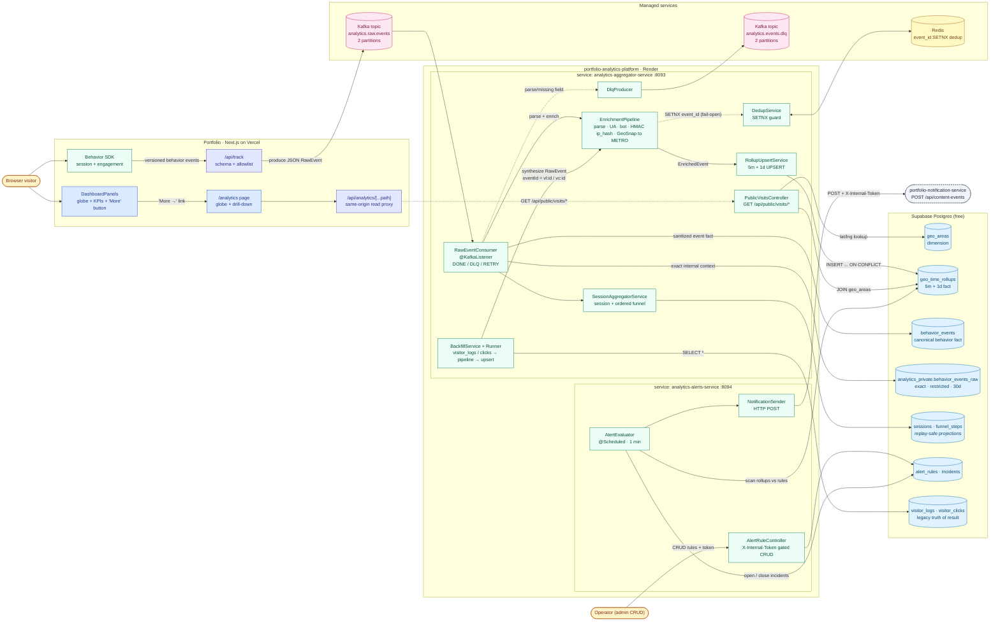

# portfolio-analytics-platform

Visitor analytics, geo aggregation, and alerting for [yuqi.site](https://yuqi.site).
Powers the **rotating globe** on the homepage dashboard and the
**`/analytics`** drill-down page.


---

## 1. Architecture

### 1.1 System-component diagram (UML / C4-style)



> **Read this as a UML component diagram:** rounded boxes are actors,
> stadium / cylinder shapes are external stores (Kafka topics, Redis,
> Postgres tables), and rectangles inside the service subgraphs are
> Spring components. Solid arrows are synchronous calls or Kafka
> produce/consume; dashed arrows are best-effort side-channels
> (dedup / DLQ / read proxy).

### 1.2 ASCII overview

```
            Ingestion API                            Kafka
   (Portfolio Next.js /api/track)   ───→    analytics.raw.events
                                                     │
                                                     ▼
                                       ┌──────────────────────────────┐
                                       │ analytics-aggregator-service │
                                       │  ┌──────────────────────┐    │
   Redis  ◀──────────  SETNX ─────────│  │  EnrichmentPipeline  │    │
   (event_id dedup)                    │  │  UA · bot · ip_hash  │    │
                                       │  │  GeoSnap → METRO     │    │
                                       │  └──────────┬───────────┘    │
                                       │             ▼                │
                                       │  ┌──────────────────────┐    │
                                       │  │ RollupUpsertService  │ ──→│──→ Supabase Postgres
                                       │  │ (5m + 1d granularity)│    │     geo_time_rollups
                                       │  └──────────────────────┘    │
                                       │                              │
                                       │  GET /api/public/visits/*    │
                                       │  → globe + /analytics page   │
                                       └──────────────────────────────┘
                                                     │
                                                     ▼
                                            analytics.events.dlq
                                            (poison-pill records)
                                                     │
                                                     ▼
                                       ┌──────────────────────────────┐
                                       │   analytics-alerts-service   │
                                       │  rule eval @ 1 min cadence   │
                                       │  HTTP → notification-service │
                                       └──────────────────────────────┘
```

### Modules

| Module | Port | Purpose |
|---|---|---|
| `analytics-common` | — | DTOs (`RawEvent`, `EnrichedEvent`, `GeoHint`), topic names, DLQ helper, `Outcome` enum (DONE / DLQ / RETRY) |
| `analytics-aggregator-service` | 8093 | Single Kafka consumer that owns the full **raw → enrich → rollup** pipeline; also runs the backfill `CommandLineRunner` and exposes `/api/public/visits/*` for the globe |
| `analytics-alerts-service` | 8094 | CRUD `/api/admin/alert-rules` (gated by `X-Internal-Token`), `@Scheduled` evaluator, HTTP fan-out to `portfolio-notification-service` |

### Why only 2 topics

The free Kafka plan caps at 2 topics. We previously had a
`raw → enrich service → enriched topic → aggregator` chain requiring 3.
**Enrichment now runs in-process inside the aggregator**, reducing the
wire surface to exactly:

- `analytics.raw.events` — every event from the Ingestion API
- `analytics.events.dlq` — poison-pill records

### Data-access boundaries

- `analytics_private.behavior_events_raw` is the only exact tier. It may
  contain request IP, raw UA, city and coordinates for internal analysis,
  is inaccessible to `PUBLIC`/browser roles, and expires after 30 days by default.
- `public.behavior_events` is the canonical source for sessions, funnels,
  content performance and recommendation features. It contains HMAC identity,
  URL paths, referrer domains and at most the enriched geo bucket.
- Public Web and MCP routes query rollups/canonical facts only. Public lists
  suppress buckets smaller than `ANALYTICS_PUBLIC_MIN_BUCKET_COUNT` (default 5).
- Dashboard coordinates come from `geo_areas` centroids, never an exact raw row.
- `visitor_logs` remains a compatibility sink but receives HMAC IP and no exact
  city/coordinates; direct browser `SELECT` grants are revoked by migration V8.

---

## 2. Local development

### Prerequisites

- JDK 21 (the Maven wrapper takes care of Maven itself)
- A reachable Postgres (Supabase URL works fine) + Redis (`brew install redis`)
- Optional: a Kafka cluster if you want to exercise the consumer

### Build + test

```bash
./mvnw -B -ntp -Pcoverage verify
```

The `coverage` profile enforces **≥ 60 % line coverage** per module. All
60 unit / slice tests should pass.

### Run the aggregator locally

```bash
cp .env.example .env
# Fill in DB credentials at minimum; Kafka/Redis can be skipped if
# you only want the public read endpoints + backfill mode.

# Steady-state consumer mode
./mvnw -B -ntp -pl analytics-aggregator-service spring-boot:run

# Or build + run the jar
./mvnw -B -ntp -pl analytics-aggregator-service -am -DskipTests package
java -jar analytics-aggregator-service/target/analytics-aggregator-service.jar
```

### Docker Compose

```bash
docker compose up --build
```

Brings up the aggregator (`:8093`) and alerts (`:8094`). Kafka / Redis /
Postgres are still external — drive via `.env`.

---

## 3. Public read API

All endpoints are unauthenticated and CORS-open by design; they only
return the same aggregate data the public dashboard already shows.

### `GET /api/public/visits/markers?days=30`

```json
[
  {
    "geoAreaId": "COUNTRY:US",
    "geoLevel":  "COUNTRY",
    "country":   "US",
    "name":      "United States",
    "region":    null,
    "lat":       39.83,
    "lng":      -98.58,
    "count":     1234
  }
]
```

Joined with `geo_areas.center_lat / center_lng` so the globe can place
pins. METRO buckets win over their COUNTRY parents when seeded.

### `GET /api/public/visits/summary?days=30`

```json
{
  "siteId":    "yuqi.site",
  "days":      30,
  "totals":       { "events": 1234, "clicks": 123, "pageViews": 1111 },
  "topCountries": [ { "country": "US", "count": 800 } ],
  "topDevices":   [ { "deviceType": "desktop", "count": 900 } ],
  "timeSeries":   [ { "bucketTime": "2025-01-01T00:00:00Z", "count": 40 } ]
}
```

### Behavior analysis endpoints

- `GET /api/public/visits/top-pages?window=7d` returns up to 25 page buckets.
- `GET /api/public/visits/referrers?window=7d` returns referrer domains only.
- `GET /api/public/visits/sessions?window=30d` returns duration/bounce aggregates.
- `GET /api/public/visits/funnel?window=30d` returns configured ordered steps.
- `GET /api/public/visits/engagement?window=30d` returns reading/active-time totals.
- `GET /api/public/visits/recommendations?window=30d` returns recommendation feedback.

All list endpoints exclude bots where applicable and suppress small buckets in SQL.
Funnel order is configured with `ANALYTICS_FUNNEL_STEPS`; URL paths never define
business funnel semantics.

Feeds the `/analytics` page on the Portfolio dashboard.

---

## 4. Wiring the Portfolio frontend

In the **`Portfolio`** repo:

1. `pages/analytics.js` renders the drill-down page (globe + KPIs + bars).
2. `pages/api/analytics/[...path].js` is a same-origin proxy that
   forwards `/api/analytics/visits/*` to the upstream aggregator, hiding
   the Render URL and avoiding cross-origin CORS.
3. The dashboard's `<RotatingGlobe>` now has a **More →** overlay button
   linking to `/analytics`.

Configure the proxy with one Vercel env var:

```bash
ANALYTICS_API_URL=https://portfolio-analytics-aggregator.onrender.com
```

(Leave it unset for local development — defaults to `http://localhost:8093`.)

---

## 5. Backfill historical data

The pre-existing `visitor_logs` (~4400 rows) and `visitor_clicks` (~400
rows) on Supabase are the **truth of result** — they predate this
platform. Rather than copy them straight into `geo_time_rollups`, the
aggregator **replays each row through the same enrichment + UPSERT
pipeline** a live Kafka event would take. That way the rollup numbers
match exactly what the live stream would produce.

```bash
# One-off pod / Render deploy with the flag flipped on
ANALYTICS_BACKFILL_ENABLED=true \
ANALYTICS_CONSUMER_ENABLED=false \
java -jar analytics-aggregator-service/target/analytics-aggregator-service.jar
```

The runner is idempotent on the input rows (it gives every synthesized
event a stable id — `vl:<id>` for `visitor_logs`, `vc:<id>` for
`visitor_clicks`), but the rollup UPSERTs themselves are additive — if
you replay twice you'll double the counts. **Truncate `geo_time_rollups`
first if you need a fresh backfill.**

---

## 6. Deploying to Render + Supabase

### 6.1 One-time provisioning

| Step | What | Where |
|---|---|---|
| 1 | Create a **Kafka** service | Cloud console → Services |
| 2 | Create the 2 topics (`analytics.raw.events`, `analytics.events.dlq`) at 2 partitions each | Kafka service → Topics |
| 3 | Create a SASL user, copy the Project CA | Kafka service → Users / CA |
| 4 | Create a **Redis** service | Cloud console → Services |
| 5 | Apply the Flyway migrations to Supabase (any V1–V3 SQL file) | Supabase SQL editor, or let the service do it on first boot |
| 6 | Note the JDBC URL + user + password from Supabase | Supabase → Project Settings → Database |

### 6.2 Apply the Render blueprint

```bash
# From the repo root
render blueprint launch
# …or paste render.yaml into Render Dashboard → Blueprints → New
```

Render will provision two web services from `render.yaml` and prompt for
every env var marked `sync: false` (Kafka creds, Redis URL, Supabase
JDBC URL/user/password, notification token, etc.). The HMAC salt is
auto-generated by Render — copy it out into your password manager since
rotating it invalidates historical `ip_hash` joins.

### 6.3 First-time backfill

Once the aggregator service is up:

1. In Render Dashboard → Service → Environment, set
   `ANALYTICS_BACKFILL_ENABLED=true` and
   `ANALYTICS_CONSUMER_ENABLED=false`.
2. Trigger a manual deploy. The boot log will stream
   `{"event":"backfill_progress","rows":1000}` updates.
3. When you see `backfill_complete`, flip the env vars back
   (`ANALYTICS_BACKFILL_ENABLED=false`, `ANALYTICS_CONSUMER_ENABLED=true`)
   and redeploy. The Kafka consumer will resume from the last committed
   offset.

### 6.4 Smoke-test

```bash
scripts/e2e-smoke.sh https://portfolio-analytics-aggregator.onrender.com
```

Checks `/actuator/health`, `/api/public/visits/markers`, and
`/api/public/visits/summary` and asserts the wire shape consumed by
the Portfolio `/analytics` page. Exits non-zero on the first failure.

---

## 7. Module conventions inherited from `portfolio-notification-service`

- **DONE / DLQ / RETRY** 3-state outcome on every `@KafkaListener`. RETRY
  sleeps 2 s before unacked re-poll; DLQ acks immediately so we don't
  spin on poison pills.
- Flyway runs with `repair()` before `migrate()` (manual hot-fixes don't
  block boot).
- `JdbcTemplate`-driven UPSERTs everywhere; no JPA, no Liquibase.
- Internal admin endpoints are gated by `X-Internal-Token`; everything
  else returns 404. The token is generated by Render on first apply.
- Tests run on **JDK 25**; the `src/test/resources/mockito-extensions/`
  file selects the subclass mock-maker because the default inline-mock
  maker doesn't work on JDK 25 yet.

---

## 8. Repo layout

```
.
├── analytics-common/                 # DTOs + topic names + DlqProducer
├── analytics-aggregator-service/     # Kafka consumer + backfill + read API
│   └── src/main/java/site/yuqi/analytics/aggregator/
│       ├── backfill/                 # BackfillService + Runner
│       ├── config/                   # AggregatorBeansConfig (Flyway, Jackson, IpHash, DLQ)
│       ├── enrich/                   # EnrichmentPipeline + IpHash / UA / Bot / GeoSnap / Dedup
│       ├── kafka/                    # RawEventConsumer (DONE / DLQ / RETRY)
│       ├── service/                  # RollupUpsertService
│       └── web/                      # PublicVisitsController
├── analytics-alerts-service/         # Rule eval + incidents + notification fan-out
├── docker-compose.yml                # Local 2-service stack
├── render.yaml                       # Production blueprint
└── scripts/e2e-smoke.sh              # Post-deploy smoke test
```
